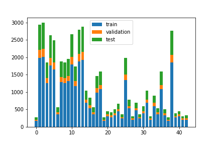

# **Traffic Sign Recognition** 

## Writeup
---

**Build a Traffic Sign Recognition Project**

The goals / steps of this project are the following:
* Load the data set (see below for links to the project data set)
* Explore, summarize and visualize the data set
* Design, train and test a model architecture
* Use the model to make predictions on new images
* Analyze the softmax probabilities of the new images
* Summarize the results with a written report

## Rubric Points
### Here I will consider the [rubric points](https://review.udacity.com/#!/rubrics/481/view) individually and describe how I addressed each point in my implementation.  

---
### Writeup / README

#### 1. Provide a Writeup / README that includes all the rubric points.

You're reading it! and here is a link to my [project code](https://github.com/hhe1667/traffic-sign-classifier/blob/master/Traffic_Sign_Classifier.ipynb)

### Data Set Summary & Exploration

I used Pandas to calculate summary statistics of the traffic signs data set:

* The size of training set is 34799
* The size of the validation set is 4410
* The size of test set is 12630
* The shape of a traffic sign image is (32, 32, 3)
* The number of unique classes/labels in the data set is 43

#### Exploratory visualization of the dataset.
I plot the distribution difference among the data sets as follows.

I also plotted example images for each of the traffic signs. The example images
are randomly picked from the training set.

### Design and Test a Model Architecture

#### 1. Pre-processing

I did a minimal pre-processing by normalizing the images. I decided not to convert the images to grayscale because I believe the color carries important information.

#### 2. Model Architecture

My model is based on the LeNet. The final model consisted of the following layers:

| Layer         		|     Description	        							| 
|:---------------------:|:-----------------------------------------------------:| 
| Input         		| 32x32x3 RGB image   									| 
| Convolution 3x3     	| kernel=5, 1x1 stride, valid padding, outputs 28x28x6 	|
| RELU					|														|
| Max pooling	      	| 2x2 stride,  outputs 14x14x6 							|
| Dropout	        	|  														|
| Convolution 3x3	    | 1x1 stride, valid padding, outputs 10x10x16			|
| RELU					|														|
| Max pooling	      	| 2x2 stride,  outputs 5x5x16 							|
| Dropout	        	|  														|
| Flatten	        	| outputs 400 											|
| Fully connected		| outputs 120        									|
| Fully connected		| outputs 84        									|
| Softmax				| outputs n_classes     								|
|						|														|

#### 3. Model training

To train the model, I used softmax cross-entropy as the loss and the
AdamOptimizer to minimize the loss. The loss converged after around 20 epochs.
I tuned the dropout rate as 0.2 which maximized the validation set accuracy.

#### 4. Getting the validation set accuracy to be at least 0.93.

I started with the LeNet model. I examined the accuracy of the training set
and validation set. The training set accuracy reached ~99.5% while the
validation set accuracy stayed around 91%. The gap indicated the model was
overfitting. Thus, I added dropout to each convolution layer. This improved
the validation set accuracy to 95.3%.

The test set accuracy 94.0% is close to that of the validation set. This gives
evidence that the validation set is representative of the test set.

My final model results were:
* training set accuracy of 99.7%
* validation set accuracy of 95.3%
* test set accuracy of 94.0%

### Test a Model on New Images

#### 1. Choose five German traffic signs found on the web and provide them in the report. For each image, discuss what quality or qualities might be difficult to classify.

I downloaded 6 traffic signs on the web by Google image search. The new images are different from the training set as follows.
* The new images are much larger 380x380 vs 32x32.
* The new images has no background, while the training set were captured from real world.
* The pedestrian sign contains crosswalk.

  
  

#### 2. Discuss the model's predictions on these new traffic signs and compare the results to predicting on the test set. At a minimum, discuss what the predictions were, the accuracy on these new predictions, and compare the accuracy to the accuracy on the test set (OPTIONAL: Discuss the results in more detail as described in the "Stand Out Suggestions" part of the rubric).

Here are the results of the prediction:

| Image			        |     Prediction	        					| 
|:---------------------:|:---------------------------------------------:| 
| no-entry.jpg     		| No entry   									| 
| pedestrians.jpg    	| General Caution (**Wrong prediction**)			|
| speed-limit-30		| Speed limit (30km/h)							|
| stop_sign.jpg	   		| Stop 							 				|
| warning.png			| General caution      							|
| yield.jpg				| Yield             							|

The model was able to correctly predict 5 out of 6 traffic signs, which gives an accuracy of 83%.
 This performance is worse than the accuracy of the test set (94%). In other words, the validation and test sets
 are not representative of the new images. Thus the model is not good enough to classify new images.

#### 3. Describe how certain the model is when predicting on each of the five new images by looking at the softmax probabilities for each prediction. Provide the top 5 softmax probabilities for each image along with the sign type of each probability. (OPTIONAL: as described in the "Stand Out Suggestions" part of the rubric, visualizations can also be provided such as bar charts)

The top-5 softmax probabilities and class names for each image are printed in the Jupyter notebook.

| no-entry.jpg | 1.0 | 3.7178788693525977e-13 | 1.2487274037055666e-17 | 8.548082026742287e-21 | 5.472243634603315e-21 | No entry | Stop |
| pedestrians.jpg | 0.9986525774002075 | 0.0013460007030516863 | 4.7523400326099363e-07 | 3.26870321032402e-07 | 3.013022933373577e-07 | General caution | Pedestrians |
| speed-limit-30.jpeg | 0.9976346492767334 | 0.002359142992645502 | 3.368551688254229e-06 | 2.2627618818660267e-06 | 4.24117558850412e-07 | Speed limit (30km/h) | Speed limit (80km/h) |
| stop_sign.jpg | 1.0 | 1.1655912679486846e-08 | 4.561031108352154e-09 | 5.856599649689542e-10 | 3.8162795146234885e-10 | Stop | Speed limit (80km/h) |
| warning.png | 0.9999949932098389 | 4.098328645341098e-06 | 9.309649726674252e-07 | 1.486771328274017e-08 | 1.1357385032439993e-09 | General caution | Pedestrians |
| yield.jpg | 1.0 | 3.772339782114678e-27 | 1.0180042625614068e-32 | 1.9832569671669157e-33 | 1.2764627722788207e-34 | Yield | Speed limit (30km/h) |

The pedestrians.jpg was mis-predicted as "General Caution". Comparing images of
the two signs, it appeared that the model was confused pedestrian with the exclamation mark.

For "speed-limit-30.jpeg", the top probability is 94.5% and the second top
probability is 5.5% with class "Speed limit (80km/h)". This implies that the
model is not that certain in predicting the actual speed limit.

### (Optional) Visualizing the Neural Network (See Step 4 of the Ipython notebook for more details)
#### 1. Discuss the visual output of your trained network's feature maps. What characteristics did the neural network use to make classifications?

